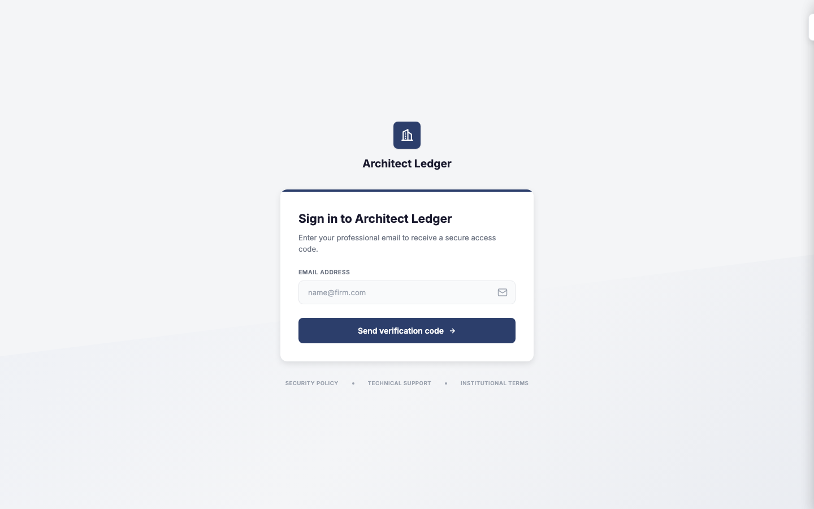
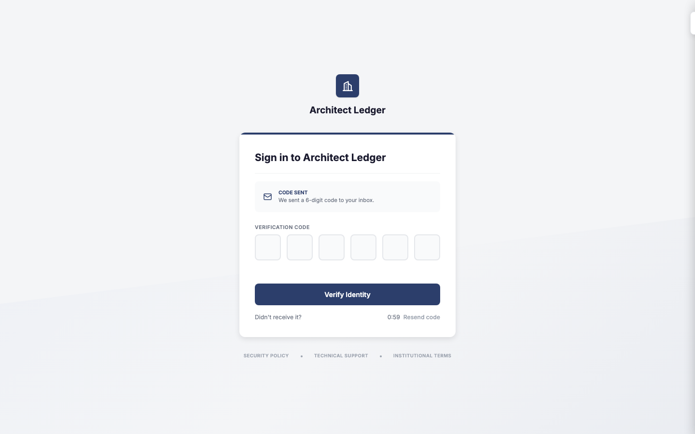
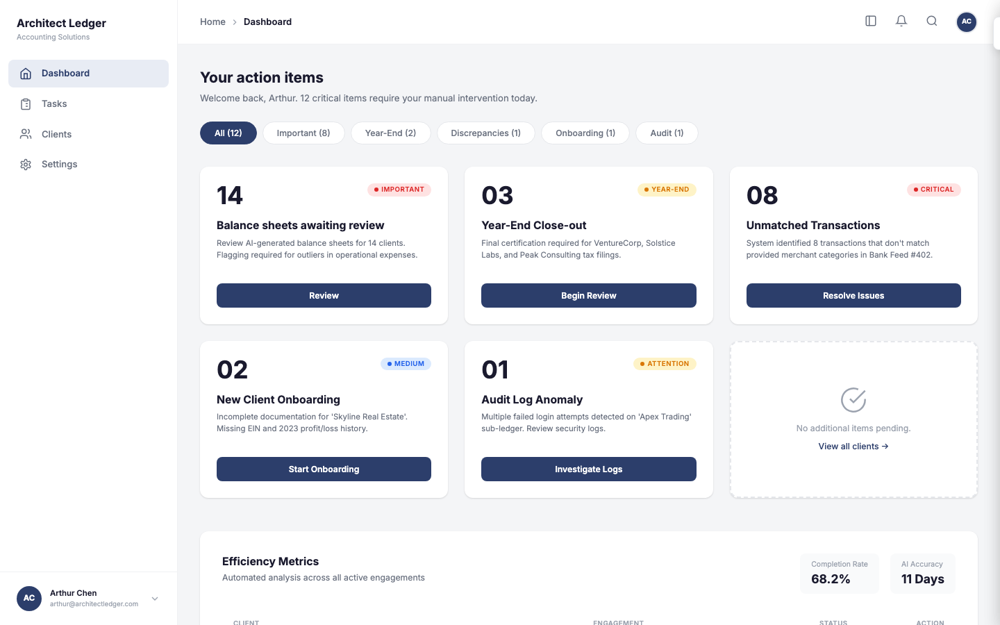
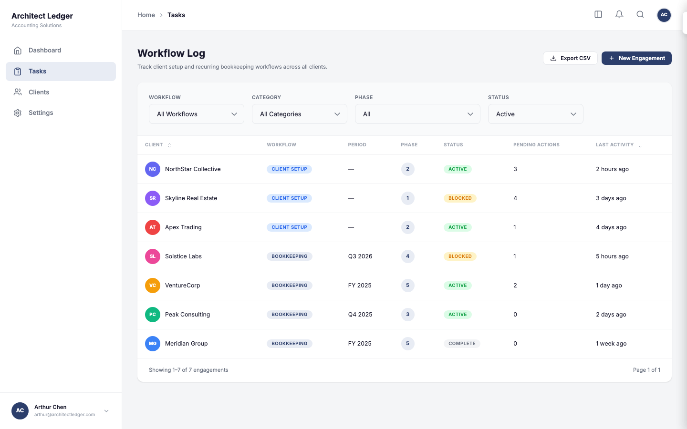
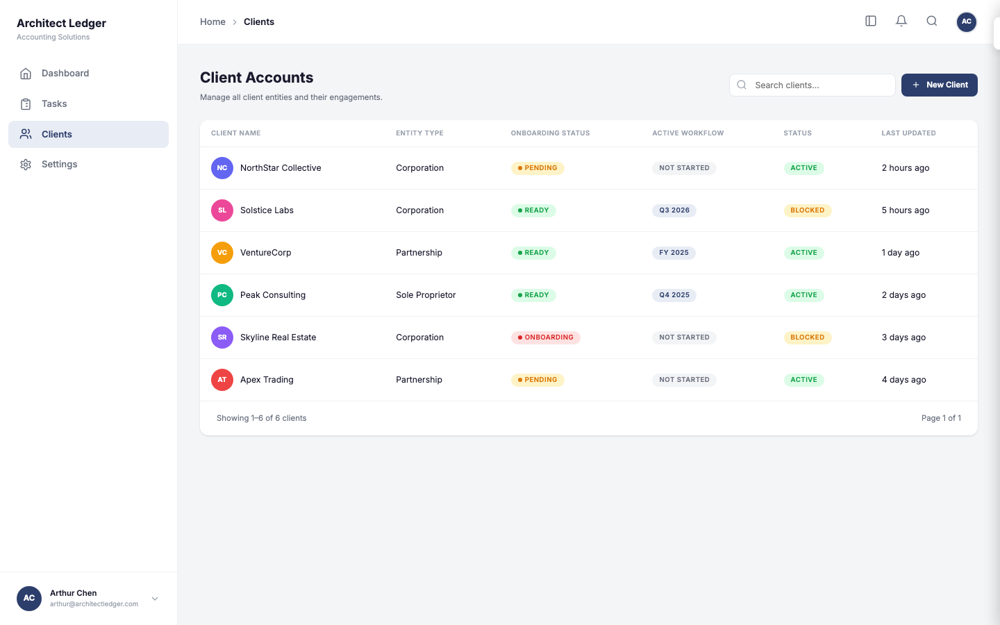
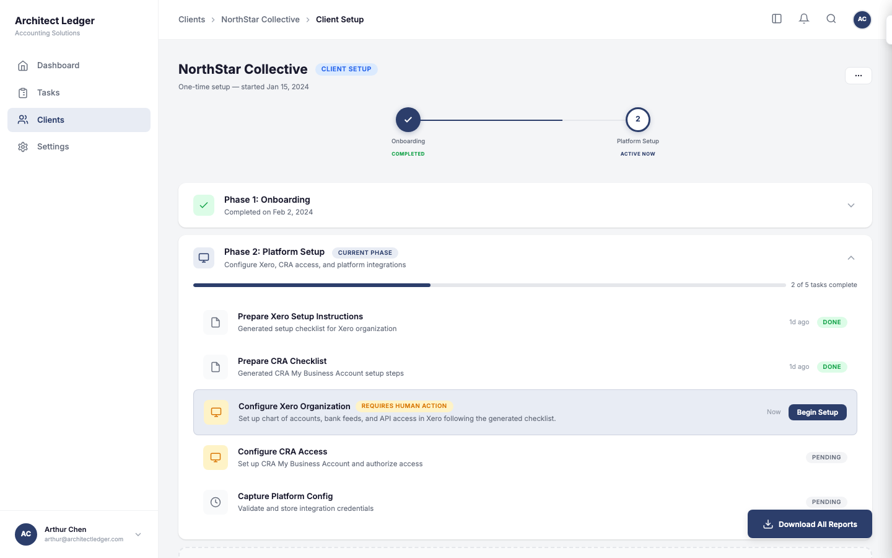
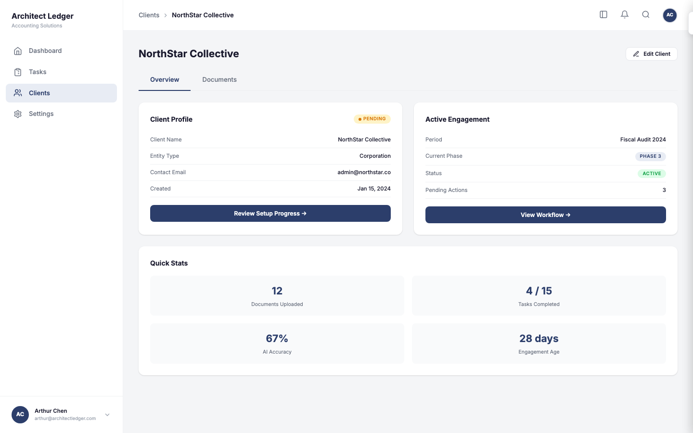
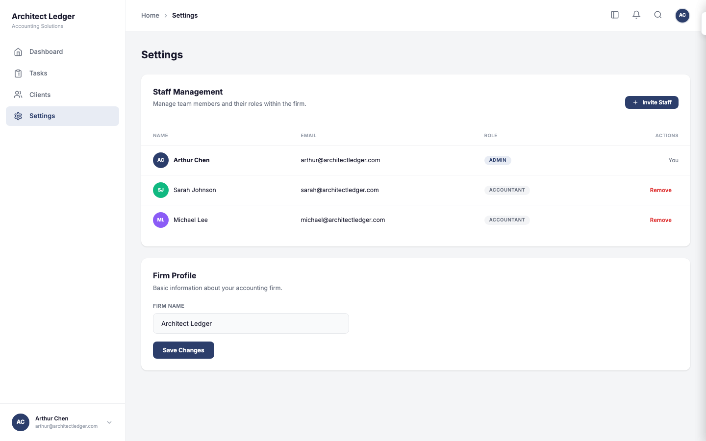
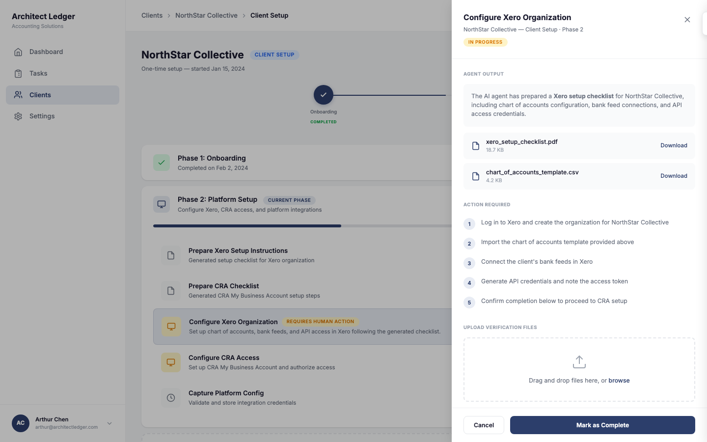

# Architect Ledger — AI-assisted bookkeeping for CPAs

**Architect Ledger** is an **AI-assisted bookkeeping platform** for accounting firms (CPAs). The product implements the **three-service architecture** from the **v1.3 orchestration plan**: a typed dashboard, an AI processing API with async workers, optional **n8n** orchestration in cloud, and shared data plane services.

This **GitHub-facing folder** is intentionally **not** the full application codebase. It **discloses only the interactive HTML prototype** (plus screenshots and optional capture tooling) so recruiters and collaborators can review **UX, flows, and design intent** without exposing private services, schemas, or keys.

**[Open this prototype in the browser](https://rayliu66.github.io/Product_Design_Protfolio/AI-accounting/prototype.html)** — hosted on GitHub Pages (`rayliu66` / `Product_Design_Protfolio`).

---

## Product architecture and technical stack (v1.3)

| Layer | Technology | Role |
|--------|------------|------|
| **Frontend** (`frontend/`) | **Next.js 15**, **TypeScript**, **Tailwind CSS**, **TanStack Query (React Query)** | Firm dashboard: auth shell, tasks, clients, engagements, settings, review surfaces (per front-end build plan §8). |
| **Backend** (`backend/`) | **FastAPI**, **Celery**, **SQLAlchemy**, **Pydantic**, **Alembic** | AI processing service: HTTP routers (plan §16), domain logic, LLM/OCR/storage/**pgvector** integrations, background workers. |
| **Orchestration** (`orchestration/`) | **n8n** (exported workflow JSON) | Cloud-only workflow automation; **skipped in typical local dev**. |
| **Shared infrastructure** | **PostgreSQL 16** + **pgvector**, **Redis**, **MinIO** (S3-compatible) | Durable data, queues/cache, object storage for documents and artifacts. |
| **Local developer experience** | **Docker Compose** (Postgres, Redis, MinIO), optional **[Tilt](https://tilt.dev)** at `http://localhost:10350` | One-command-ish local stack; Tilt is optional single-pane dev dashboard. |

Implementation languages: **Python 3.12+** on the API/workers; **Node** for the Next.js app. **Caddy** and infra helpers live under `infra/` in the private monorepo.

---

## Source of truth (Notion)

| Document | Purpose |
|----------|---------|
| [AI Bookkeeping Orchestration Plan v1.3 (back-end version)](https://www.notion.so/AI-Bookkeeping-Orchestration-Plan-v1-3-back-end-version-33d8d41a5cff8018977ef070724c36ba) | Orchestration, services, API shape, and backend alignment. |
| [Front-end build plan — structure](https://www.notion.so/front-end-build-plan-stucture-34b8d41a5cff80c6bae3c3ca4cf481b3) | Routes, feature modules, and dashboard composition. |

---

## Monorepo layout (private implementation)

The **production codebase** lives in a **private monorepo** (not published in this portfolio folder). Its layout matches the following structure for clear service boundaries and local parity with cloud:

```
.
├── backend/                 FastAPI AI service (Python 3.12+)
│   ├── app/
│   │   ├── api/             HTTP routers (plan §16)
│   │   ├── core/            Domain logic
│   │   ├── models/          Pydantic schemas + SQLAlchemy tables
│   │   ├── services/        LLM / OCR / storage / pgvector wrappers
│   │   ├── config.py
│   │   └── main.py
│   ├── workers/             Celery workers
│   ├── migrations/          Alembic
│   ├── tests/
│   └── Dockerfile
│
├── frontend/                Next.js 15 dashboard (TypeScript + Tailwind)
│   └── src/
│       ├── app/             Routes: (auth), (dashboard)
│       ├── components/      layout, ui, common
│       ├── features/        auth, dashboard, tasks, clients, engagements,
│       │                      settings, review-panel (plan §8)
│       ├── lib/               api, query, env
│       ├── services/          Cross-feature API services
│       ├── types/             Shared DTOs
│       ├── providers/         AppProvider + QueryProvider
│       ├── hooks/
│       ├── utils/
│       ├── constants/
│       └── styles/
│
├── orchestration/           Exported n8n workflow JSON (cloud-only)
├── infra/                   Docker-stack helpers (Postgres init SQL, Caddyfile, etc.)
├── docs/                    Architecture notes
├── src/                     Legacy Python POC (reference only)
├── docker-compose.yml       Local stack: Postgres + Redis + MinIO
├── scripts/                 dev-up, dev-down, open-tilt-ui, check-local
├── Tiltfile                 Optional Tilt dashboard
├── Makefile                 Developer shortcuts
├── .env.example             Copy to `.env` (never commit real secrets)
└── .gitignore
```

---

## What this repository folder actually contains (public disclosure)

| Path | Description |
|------|-------------|
| [`prototype.html`](prototype.html) | **Single-file** high-fidelity UI prototype (vanilla HTML/CSS/JS). Maps to dashboard, tasks, clients, workflow phases, HITL review panel, and settings—**no** Next.js runtime and **no** API calls. |
| [`assets/screenshots/`](assets/screenshots/) | Static captures of the prototype for README and decks. |
| [`scripts/capture-all.mjs`](scripts/capture-all.mjs), [`package.json`](package.json) | Optional **Playwright** automation to regenerate screenshots. |

**Not included here:** `frontend/`, `backend/`, `orchestration/`, `infra/`, Compose/Tilt files, or `.env`—those remain in the **private** monorepo.

---

## Screenshots (prototype)

Captured at **1440×900** from [`prototype.html`](prototype.html) (hash routes). Safe to embed in GitHub, LinkedIn, or slide decks.

| Screen | Description |
|--------|-------------|
|  | **Sign in — email:** passwordless-style entry. |
|  | **Sign in — verification:** 6-digit code pattern. |
|  | **Dashboard:** action cards, filters, KPI strip, engagements. |
|  | **Tasks:** workflow log with phase/status filters. |
|  | **Clients:** directory with status and pending actions. |
|  | **Workflow detail:** phased progress, agent vs human tasks. |
|  | **Client detail:** tabbed profile and stats. |
|  | **Settings:** firm profile patterns. |
|  | **HITL slide-over:** human review of agent output and uploads. |

---

## Portfolio prototype — technical stack (this artifact only)

The disclosed prototype is **not** the Next.js app; it is a **standalone static page** for fast sharing and design critique.

| Layer | Choice |
|--------|--------|
| **Delivery** | Single file [`prototype.html`](prototype.html). |
| **Markup / style / behavior** | HTML5, **vanilla CSS** (design tokens in `:root`, Flexbox, Grid, `@media`), **vanilla JavaScript** (routing via `location.hash`, no bundler). |
| **Typography** | [**Inter**](https://fonts.google.com/specimen/Inter) (Google Fonts). |
| **Icons** | Inline SVG. |
| **Data** | Hard-coded demo content; no Postgres, Redis, or MinIO in the browser build. |

---

## How to view the prototype

**[Open this prototype in the browser](https://rayliu66.github.io/Product_Design_Protfolio/AI-accounting/prototype.html)** (GitHub Pages — full interactive UI).

GitHub’s **Code** tab for `prototype.html` shows **HTML source only**, not the running app. For offline or forked copies: clone the repo, open `AI-accounting/prototype.html` locally, or run `python3 -m http.server` from the repo root and visit `http://localhost:8000/AI-accounting/prototype.html`.

---

## Regenerating screenshots

From `AI-accounting/` (requires **Node.js 18+**):

```bash
npm install
npx playwright install chromium
npm run screenshots
```

Runs [`scripts/capture-all.mjs`](scripts/capture-all.mjs) and refreshes `assets/screenshots/*.png`.

---

## Scope and disclaimer

The **prototype** uses **fictional** firm names and metrics. It is **not** financial, legal, or tax advice, and it does **not** implement production authentication or compliance controls.

---

## Parent portfolio

This project is listed under the public portfolio index: [`../README.md`](../README.md).
