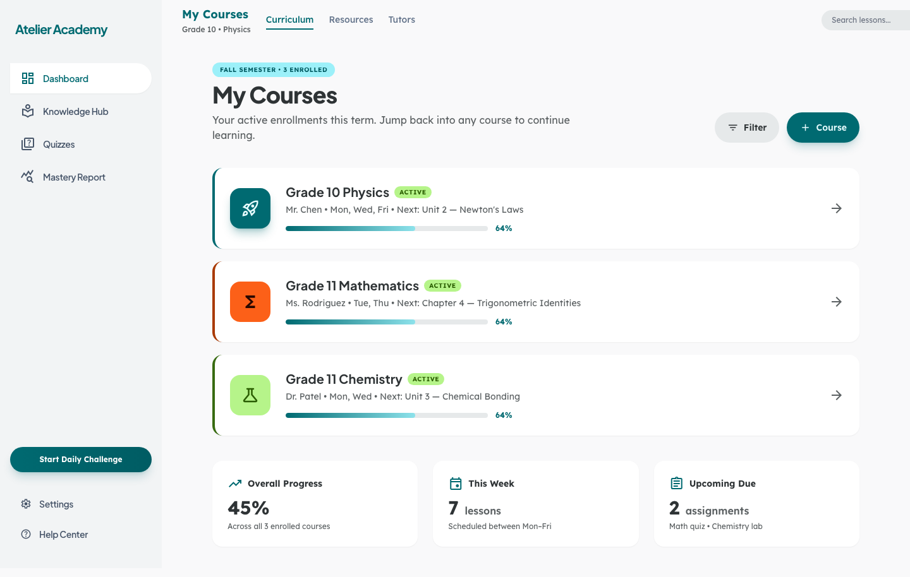
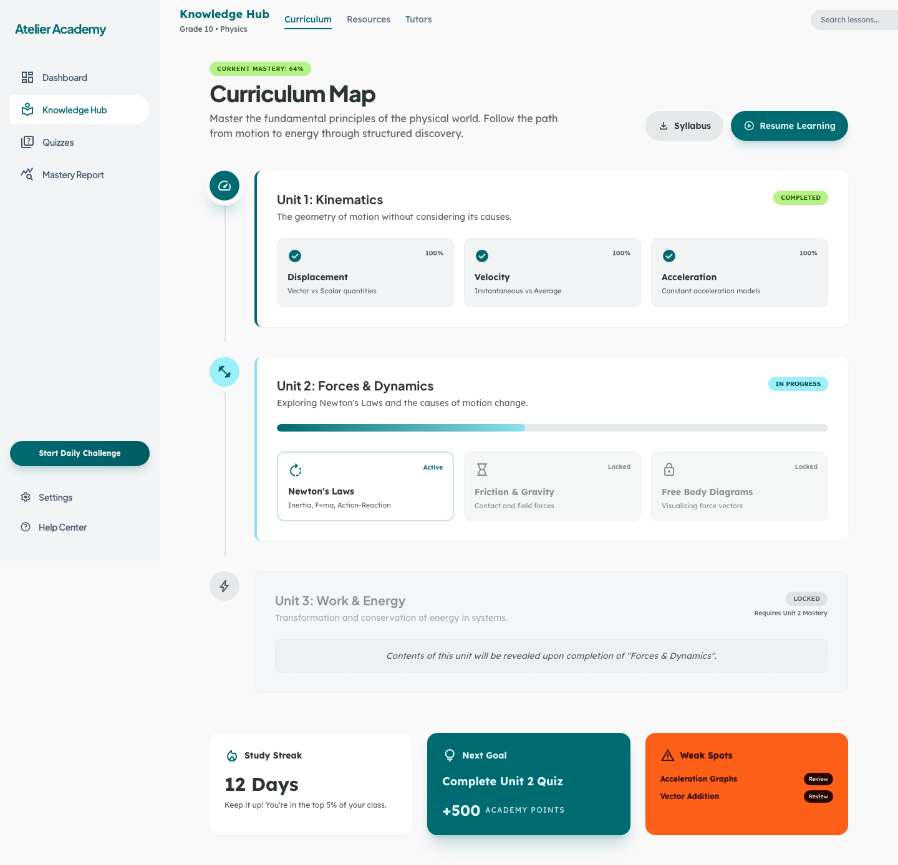
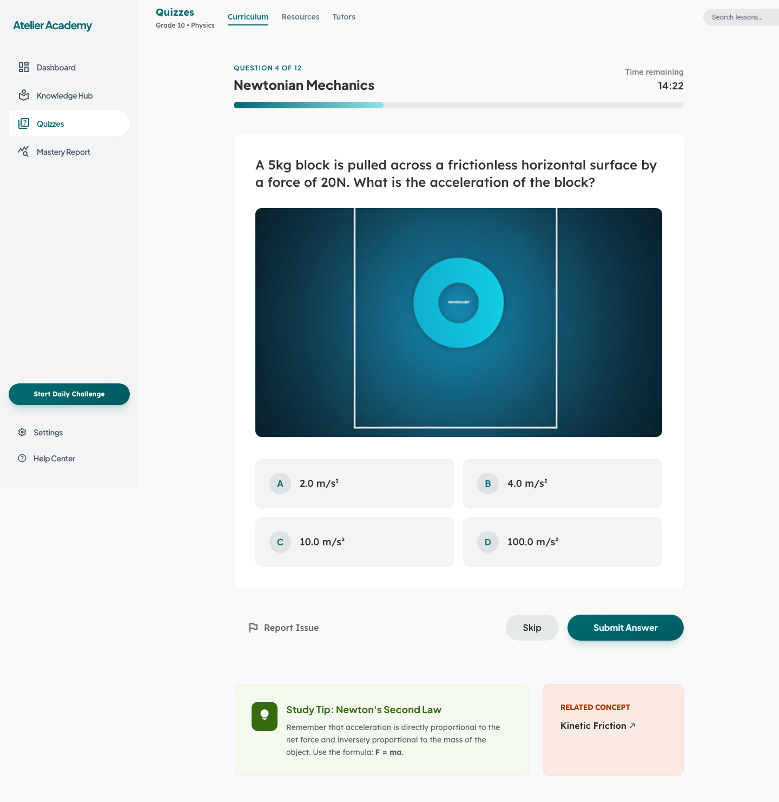
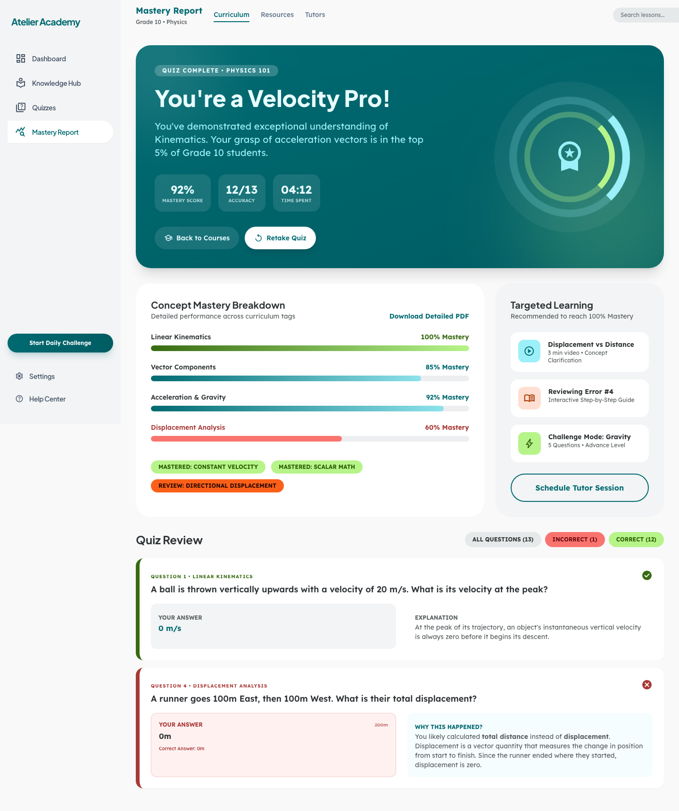

# Atelier Academy — AI-assisted K–12 learning (Knowledge Mastery Hub)

**Atelier Academy** is an **AI-assisted K–12 learning** product concept: a **Knowledge Mastery Hub** with a student dashboard, **Knowledge Hub** discovery, **Quizzes**, and **Mastery Report** analytics—backed in production by a typed web app, APIs, and optional workflow orchestration.

This **GitHub-facing folder** is intentionally **not** the full application codebase. It **discloses only the interactive HTML prototype** (plus screenshots and optional capture tooling) so recruiters and collaborators can review **UX, flows, and design intent** without exposing private curriculum data, models, or student PII.

**[Open this prototype in the browser](https://rayliu66.github.io/Product_Design_Protfolio/AI-edu-K12/index.html)** — hosted on GitHub Pages (`rayliu66` / `Product_Design_Protfolio`).

---

## Product architecture and technical stack (target)

| Layer | Technology | Role |
|--------|------------|------|
| **Frontend** (`frontend/`) | **Next.js 15**, **TypeScript**, **Tailwind CSS**, **TanStack Query (React Query)** | Student and educator surfaces: dashboard, **Knowledge Hub**, **Quizzes**, **Mastery Report**, auth, daily challenge, settings. |
| **Backend** (`backend/`) | **FastAPI**, **Celery**, **SQLAlchemy**, **Pydantic**, **Alembic** | Curriculum and enrollment APIs, quiz scoring, **LLM** endpoints for hints and feedback (policy-guarded), mastery analytics, exports. |
| **Orchestration** (`orchestration/`) | **n8n** (exported workflow JSON) or equivalent | Optional scheduled jobs, content refresh, SIS/LMS integrations in deployed environments. |
| **Shared infrastructure** | **PostgreSQL** (optional **pgvector** for RAG on approved content), **Redis**, **MinIO** (S3-compatible) | Relational mastery data, cache/sessions, media and generated artifacts. |
| **Local developer experience** | **Docker Compose** (Postgres, Redis, MinIO), optional **[Tilt](https://tilt.dev)** at `http://localhost:10350` | Local stack parity with cloud; Tilt optional single-pane dev dashboard. |

Implementation languages: **Python 3.12+** on the API/workers; **Node** for the Next.js app. **Caddy** and infra helpers would live under `infra/` in the private monorepo.

---

## Source of truth (Notion)

| Document | Purpose |
|----------|---------|
| *(Add link)* — **Product & curriculum spec** | Mastery model, scope/sequence, and compliance notes (e.g. consent, data retention). |
| *(Add link)* — **Front-end build plan** | Routes, feature modules, student vs educator shells. |

Replace the placeholder rows with your public Notion URLs when ready.

---

## Monorepo layout (private implementation)

The **production codebase** lives in a **private monorepo** (not published in this portfolio folder). Its layout matches the following structure for clear service boundaries and local parity with cloud:

```
.
├── backend/                 FastAPI learning service (Python 3.12+)
│   ├── app/
│   │   ├── api/             HTTP routers: courses, quizzes, attempts, reports, tutor
│   │   ├── core/            Domain logic: mastery, skills, recommendations
│   │   ├── models/          Pydantic schemas + SQLAlchemy tables
│   │   ├── services/        LLM adapters, scoring, content indexing / pgvector
│   │   ├── config.py
│   │   └── main.py
│   ├── workers/             Celery workers
│   ├── migrations/          Alembic
│   ├── tests/
│   └── Dockerfile
│
├── frontend/                Next.js 15 dashboard (TypeScript + Tailwind)
│   └── src/
│       ├── app/             Routes: (auth), (student), (educator)
│       ├── components/      layout, ui, common
│       ├── features/        dashboard, knowledge-hub, quizzes,
│       │                      mastery-report, daily-challenge, settings
│       ├── lib/             api, query, env
│       ├── services/        Cross-feature API services
│       ├── types/           Shared DTOs
│       ├── providers/       AppProvider + QueryProvider
│       ├── hooks/
│       ├── utils/
│       ├── constants/
│       └── styles/
│
├── orchestration/           Exported n8n workflow JSON (optional / cloud)
├── infra/                   Docker-stack helpers (Postgres init SQL, Caddyfile, etc.)
├── docs/                    Architecture notes
├── docker-compose.yml       Local stack: Postgres + Redis + MinIO
├── scripts/                 dev-up, dev-down, check-local
├── Tiltfile                 Optional Tilt dashboard
├── Makefile                 Developer shortcuts
├── .env.example             Copy to `.env` (never commit real secrets)
└── .gitignore
```

---

## What this repository folder actually contains (public disclosure)

| Path | Description |
|------|-------------|
| [`index.html`](index.html) | **Single-file** high-fidelity UI prototype (**Tailwind CDN** + **vanilla JS** hash routes `#knowledge`, `#course`, `#quiz`, `#report`). **No** Next.js build and **no** API calls. |
| [`assets/screenshots/`](assets/screenshots/) | Static captures of the prototype for README and decks. |
| [`scripts/capture-all.mjs`](scripts/capture-all.mjs), [`package.json`](package.json) | Optional **Playwright** automation to regenerate screenshots. |

**Not included here:** `frontend/`, `backend/`, `orchestration/`, `infra/`, Compose/Tilt files, or `.env`—those remain in the **private** monorepo.

---

## Screenshots (prototype)

Captured in Chromium (**1440px** viewport width, **full page**) from [`index.html`](index.html) (hash routes). Safe to embed in GitHub, LinkedIn, or slide decks.

| Screen | Description |
|--------|-------------|
|  | **Dashboard (`#knowledge`):** enrolled courses, progress, weekly summary. |
|  | **Knowledge Hub (`#course`):** units, pacing, continue learning. |
|  | **Quizzes (`#quiz`):** practice framing, difficulty, attempts. |
|  | **Mastery Report (`#report`):** skills, trends, narrative summaries. |

---

## Portfolio prototype — technical stack (this artifact only)

The disclosed prototype is **not** the Next.js app; it is a **standalone static page** for fast sharing and design critique.

| Layer | Choice |
|--------|--------|
| **Delivery** | Single file [`index.html`](index.html). |
| **Markup / style / behavior** | HTML5, **Tailwind CSS** via [Play CDN](https://tailwindcss.com/docs/installation/play-cdn) with inline `tailwind.config` (extended color tokens), **vanilla JavaScript** (hash routing; no bundler). |
| **Typography** | [**Plus Jakarta Sans**](https://fonts.google.com/specimen/Plus+Jakarta+Sans), [**Lexend**](https://fonts.google.com/specimen/Lexend) (Google Fonts). |
| **Icons** | [**Material Symbols Outlined**](https://fonts.google.com/icons) (font). |
| **Data** | Hard-coded demo content in markup; no Postgres, Redis, or MinIO in the browser build. |

---

## How to view the prototype

**[Open this prototype in the browser](https://rayliu66.github.io/Product_Design_Protfolio/AI-edu-K12/index.html)** (GitHub Pages — full interactive UI).

GitHub’s **Code** tab for `index.html` shows **HTML source only**, not the running app. For offline or forked copies: clone the repo, open `AI-edu-K12/index.html` locally, or run `python3 -m http.server` from the repo root and visit `http://localhost:8000/AI-edu-K12/index.html`.

---

## Regenerating screenshots

From `AI-edu-K12/` (requires **Node.js 18+**):

```bash
npm install
npx playwright install chromium
npm run screenshots
```

Runs [`scripts/capture-all.mjs`](scripts/capture-all.mjs) and refreshes `assets/screenshots/*.png`.

---

## Scope and disclaimer

The **prototype** uses **fictional** names, scores, and schedules. It is **not** legal guidance for **COPPA**, **FERPA**, or regional education privacy rules, and it does **not** implement production authentication or district agreements.

---

## Parent portfolio

This project is listed under the public portfolio index: [`../README.md`](../README.md).
